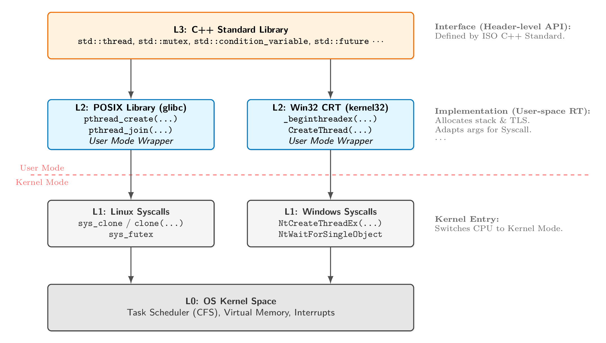
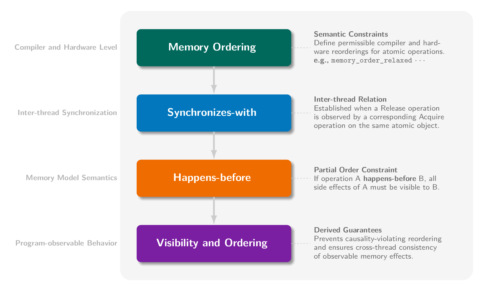

## 1. C++多线程历史

在 C++11 之前，C++ 只是一个“单线程语言”。要实现多线程，必须针对不同操作系统调用底层 API（如 Linux 的 `pthread` 或 Windows 的 `WinAPI`）。



| 特性 | C++98 / C++03 | C++11 及以后 |
| :--- | :--- | :--- |
| **线程感知** | **无** (语言层面不承认线程存在) | **原生支持** (`std::thread`) |
| **内存模型** | 无 (依赖编译器/硬件，易出 Bug) | **定义了严格的内存模型** |
| **跨平台** | 需手写 `#ifdef _WIN32` 或依赖 Boost | 标准库统一封装，代码通用 |
| **原子操作** | 依赖汇编或 OS API (`InterlockedIncrement`) | `std::atomic` 模板类 |

### 1.1 内存模型 (Memory Model)

* **最小内存单位 (Memory Location)**：最小可独立访问单元，不同单位的访问不会形成数据竞争（无需同步）；
* **数据竞争 (Data Race)**：多个线程对同一块内存单位（至少有一个）**写**，未加同步措施 $\rightarrow$ **未定义行为**。
* **修改顺序 (Modification Order)**：对**单个**原子变量存在全局一致的修改顺序。

### 1.2 同步 (Synchronization) 三要素

1.  **原子性 (Atomicity)**：最小操作不可分割，中间状态不可见。
2.  **可见性 (Visibility)**：通过**同步原语**约束，其他线程能够观察到某个线程的对共享变量的修改。
3.  **有序性 (Ordering)**：允许编译器和处理器重排序，但不能违反 happens-before 所建立的因果顺序。



---

## 2. 线程管理

### 2.1 Show Me Your Code.

- ：用 RAII 类自动管理线程，避免忘记 join/detach 导致资源泄漏或访问悬空引用。
- ：
  - 工厂模式 (spawn_worker)：将线程创建逻辑封装，返回`std::thread`对象，**由调用者决定回收策略**。
  - 批量管理：通过移动语义使用一个线程容器`std::vector<std::thread>`批量管理线程，简化代码。
- ：`std::jthread`，自动汇合，支持协作式中断。

### 2.2 线程管理与避坑指南

> `std::thread`是用户态的句柄，底层通常对应一个由操作系统内核管理的线程实体。但本质都不是 CPU 核心：线程是操作系统调度的最小单位，CPU 核心是实际执行指令的硬件资源。

> **⚠ 注意**：
> - **避免 Vexing Parse**：使用统一初始化`std::thread t1{task()};`或Lambda表达式`std::thread t2([]{ ... });`
> - **最佳实践**：使用 RAII 类管理线程生命周期，抛出异常时要确保线程资源被正确回收（使用try-catch或RAII类）。
> - **参数传递**：传参时默认按值拷贝，字符串字面量必须显式转换为`std::string`，引用`std::ref`或`std::cref`，不可拷贝类型必须使用`std::move`传递。
> - std::thread本身只能移动(move)，**不可拷贝**。（比如压入`std::vector`或从工厂函数返回（NRVO））
> - 线程数应结合任务粒度（IO密集型 vs CPU密集型）动态调整，可使用`std::thread::hardware_concurrency()`确定硬件支持的并发线程数。

---

## 2. 共享数据保护（Mutex & Lock）

### 2.1 Show Me Your Code.


### 2.2 互斥锁原理与避坑指南

> 并发问题的本质：一个线程在尚未恢复共享状态**不变量**时，被另一个线程观察或干扰。竞态条件有：数据竞争、高层竞态。
> 1. **数据竞争**：多线程访问同一内存单元，至少一个是写操作，且未加同步措施 $\rightarrow$ 未定义行为。
> 2. **高层竞态**：即使不存在数据竞争，线程执行顺序仍可能导致程序违反逻辑约束或语义期望的情况。
>   - 接口竞争（check-then-act）：比如经典的序列错误`if (!s.empty()) { int v = s.top(); s.pop(); }`。
>   - 丢失更新（lost update）：读取-修改-写入序列的中间状态被其他线程观察到，导致逻辑冲突。
> **解决方案**：
> 1. **阻塞同步**（悲观锁定）：通过互斥锁(`std::mutex`)强行**串行化**，确保同一时间只有一个线程访问**临界区**。
> 2. **无锁编程**（底层原语）：利用 CPU 提供的原子指令(CAS, `std::atomic`)争抢资源，失败则**自旋**重试。
> 3. **软件事务内存**（乐观并发）：将一组操作封装为事务，提交时检测版本冲突，若冲突则**回滚并自动重试**。
> 4. **异步消息传递**（无共享）：**通过通信共享内存**（Actor/CSP模型），线程间持有私有状态，通过消息队列交互。

> **⚠ 注意**：
> 1. **避免数据外泄**：保护共享数据时，避免返回受保护数据的**引用或指针**、将受保护数据传参给**外部回调函数**。
> 2. **死锁 (Deadlock) 防御体系**：避免互持锁等待。
>   - 首选方案 (C++17)：使用`std::scoped_lock`。能一次性以原子方式锁定多个 Mutex，内部算法保证上锁顺序一致。
>   - 备选方案 (C++11)：使用`std::lock(m1, m2, ...)`配合`std::lock_guard`的`std::adopt_lock`参数。
> 3. **减小临界区与锁竞争**：细粒度锁、读写锁分离、步进式加锁（Hand-over-hand Locking 遍历链表或树形结构）。
> 4. **try-lock 策略**：try-lock 无法获得锁时，立即释放已持有的所有锁并回滚状态，延迟后重新尝试（自我剥夺）。
> 5. **锁层级设计**：为每个互斥量分配层级编号，规定线程只能按照编号递减（或递增）的顺序加锁，消除环路等待。

> **∴ 总结**：优先采用**串行化或粗粒度锁**以保证系统正确、可维护；在体系结构层面引入细粒度锁、无锁队列或层级锁协议。

> **RAII 风格的锁管理**：`std::lock_guard`(C++11)，`std::unique_lock`(C++11)，`std::shared_lock`(C++14)，`std::scoped_lock`(C++17)。

---

## 3. 同步操作

### 3.1 代码

```cpp
// 条件变量 (Condition Variable) —— 0 CPU 占用，被唤醒时立即响应
void wait_cv() {
    std::unique_lock<std::mutex> lk(m); // 必须用 unique_lock
    // wait 自动处理：解锁 -> 阻塞 -> (被唤醒) -> 加锁 -> 检查谓词
    cv.wait(lk, []{ return ready; }); 
    std::cout << "[CV] Done.\n";
}

void signal_worker() {
    std::this_thread::sleep_for(std::chrono::milliseconds(500));
    {
        std::lock_guard<std::mutex> lk(m);
        ready = true;
        std::cout << "[Main] Signal sent.\n";
    }
    cv.notify_all(); // 惊群
}

// ---------------------------------------------------------
// 3.1 std::async (自动/半自动启动）
// ---------------------------------------------------------
std::future<int> f1 = std::async(std::launch::async, []{ 
    return 42; 
});

auto f2 = std::async(std::launch::deferred, []{ 
    std::cout << "Deferred task running...\n"; 
    return 100; 
});

// f2 此时并未执行，直到下面这行被调用(惰性求值)
int res2 = f2.get();

// ---------------------------------------------------------
// 3.2 std::packaged_task (手动包装 -> 线程池入队)
// ---------------------------------------------------------
std::packaged_task<int(int, int)> task([](int a, int b) {
    return a + b;
}); // 1. 包装一个任务（类似 std::function，但关联了 future）

std::future<int> f = task.get_future(); // 2. 获取 future

// 3. 手动执行异步任务，模拟线程池入队
std::thread worker_thread([](std::packaged_task<int(int, int)> t) {
    t(10, 20); // 4. 在工作线程中执行任务，Future 状态变为 ready
}, std::move(task)); // task 是 move-only 的

std::cout << "Packaged Task Result: " << f.get() << "\n";
worker_thread.join();

// ---------------------------------------------------------
// 3.3 std::promise (手动设置结果/异常)
// ---------------------------------------------------------
std::promise<int> p;
std::future<int> f = p.get_future();

std::thread t([&p]{
    try {
        // throw std::runtime_error("Error in promise!"); 
        p.set_value(99); // 发送结果
    } catch (...) {
        p.set_exception(std::current_exception()); // 发送异常
    }
});

try {
    std::cout << "Promise Result: " << f.get() << "\n";
} catch (const std::exception& e) {
    std::cout << "Promise Exception: " << e.what() << "\n";
}
t.join();

// ---------------------------------------------------------
// 3.4 std::shared_future (广播机制)
// ---------------------------------------------------------
std::promise<int> p;
// 将普通 future 转换为 shared_future (所有权转移)
std::shared_future<int> sf = p.get_future().share(); 

auto wait_func = [](std::shared_future<int> f, int id) {
    // 多个线程可以同时 wait/get 同一个 shared_future
    std::cout << "Thread " << id << " got: " << f.get() << "\n";
};

std::thread t1(wait_func, sf, 1);
std::thread t2(wait_func, sf, 2);
std::thread t3(wait_func, sf, 3);

std::this_thread::sleep_for(std::chrono::milliseconds(100));
p.set_value(888); // 一处设置，三处同时唤醒

t1.join(); t2.join(); t3.join();

// ---------------------------------------------------------
// 3.5 时间处理机制 (chrono) & 超时控制
// ---------------------------------------------------------
using namespace std::chrono_literals;
auto d1 = 500ms;                                            // std::chrono::duration<int, std::milli>
auto d2 = 2s;                                               // std::chrono::seconds

auto timeout_tp = std::chrono::steady_clock::now() + 500ms; // std::chrono::time_point
std::this_thread::sleep_until(timeout_tp);                  // 线程休眠直到指定时间点

// ---------------------------------------------------------
// 3.6 函数化链式编程风格的并发范式 (Boost.Thread)
// ---------------------------------------------------------
#include <boost/thread/future.hpp>

future<int> f1 = async(authenticate);
future<std::string> f2 = f1.then([](future<int> prev_f) {
    int user_id = prev_f.get();
    return get_username(id);    // 返回 future<std::string> 自动展平
});
future<void> f3 = when_all(f1, f2).then([](std::vector<future_base>& results) {
    int id = results[0].get();
    std::string name = results[1].get();
    log_user_login(id, name);
});
f3.wait(); // 等待所有任务完成
```

### 3.2 同步操作原理与避坑指南

> 线程控制块(TCB)是操作系统管理线程的唯一标识：Thread ID、CPU 上下文 (PC指针, SP指针, 寄存器)、线程状态、调度优先级、信号掩码等。
> TCB在CPU核心和两大队列中流转：运行队列（就绪队列）、等待队列。
> 线程状态：
> - 运行：TCB 上下文加载到寄存器中，CPU硬件核心执行线程指令。                   RUNNING
> - 就绪：TCB 存于运行队列中，等待调度器分配 CPU 时间片。                      READY
> - 阻塞：TCB 移出运行队列，挂入对应的等待队列中，等待外部事件（锁、I/O、信号）。   BLOCKED
> - 挂起：TCB 仍然在内存中，但进程的虚拟内存被换出到磁盘，等待恢复。
> - 终止：线程执行完毕，资源（栈、寄存器）立即释放，仅留 TCB 等待父进程/主线程（Zombie/Terminate）回收。

> 线程同步形式上表现为**条件变量**(condition variables)和**异步任务**(future/promise)两大类。

> 1. 基于状态的同步（**条件变量**）：线程等待某个条件达成（如数据可用、资源释放），通过共享内存通信，通过互斥锁保护共享数据和条件状态。
>  - 等待策略：忙等（运行状态，轮询检查）、周期性休眠（进入阻塞状态，偶尔进入运行状态检查）、条件变量（释放锁并进入阻塞状态，等待通知）。
>  - 通知机制：`notify_one()`将等待队列中一个TCB移回运行队列，`notify_all()`将所有等待TCB移回运行队列（惊群）。

> 2. 基于事件的同步（**异步任务**）：线程等待某个异步事件完成，通过`std::future`查询事件状态和获取结果，通过`std::promise`对象设置事件结果。
>  - `std::future`结果获取方式：`::get()`阻塞等待结果，`::wait()`阻塞等待任务完成，`::wait_for()`和`::wait_until()`限时等待。
>  - `std::async`立即或延迟执行任务，返回`std::future`；`std::packaged_task`将可调用对象包装为异步任务，可与`std::future`关联。
> **注意**：
>  1. `std::futrue`/`std::promise`本质是一个单向的、一次性的通信管道。（`std::future`是独占的占位符，`std::promise`只能设置一次结果。）
>  2. 异步任务中的异常会被捕获并存储在`std::future`对象中，调用`get()`时重新抛出。`std::promise`也传递异常。 （异常传播）
>  3. `std::shared_future`允许多个线程共享同一个异步事件，同时持有结果副本，底层任务完成时所有等待线程被唤醒。  （广播）
>  4. `std::async`的启动策略可控：立即执行、延迟执行、系统决定（默认）。延迟执行任务直到调用`get()`或`wait()`。 （惰性求值）
>  5. `std::async`会返回一个`std::future`对象，如果不保存该对象，任务会在`std::future`析构时阻塞等待完成。  （退化为串行同步）

> 3. C++11引入`<chrono>`头文件，提供类型安全的**时间处理机制**，包括纪元(epoch)、时间段(duration)、时间点(time_point)三大核心概念。
>   - 纪元(epoch)：时钟的起点，不同时钟类型的纪元不同（如Unix纪元1970-01-01`system_clock`，系统启动时间`steady_clock`等）。
>   - 时间段(duration)`std::chrono::duration<Rep, Period>`：表示两个时间点之间的差值，由节拍数值类型和节拍单位类型组成。
>    - 节拍数值类型：表示时间段的数值类型，如`int`, `long`, `double`等。
>    - 节拍单位类型：表示时间单位的分数，如`std::ratio<1, 1000>`表示毫秒(ms)、`std::ratio<60>`表示分钟(min)。
>   - 时间点(time_point)`std::chrono::time_point<Epoch, Duration>`：表示某个时刻，由纪元时钟类型和持续时间段类型组成。
> **线程休眠**（`std::this_thread::sleep_for`/`sleep_until`）；**同步等待**（条件变量、互斥量、异步任务的`wait_for`/`wait_until`）。
> **注意**：
> 1. `wait_for`默认使用稳定时钟，但容易陷入**假唤醒**无限等待，相当于`wait_until(now() + dur)`，`wait_until`更可靠。
> 2. 时间段支持隐式转换（大单位向小单位），但浮点数字面量可能导致精度损失，建议使用显式转换`std::chrono::duration_cast`。
> 3. 超时控制全景图
```
+-------------------------------+--------------------------+----------------------------+
| namespace                     | func (for/until)         | return                     |
+-------------------------------+--------------------------+----------------------------+
| std::this_thread              | sleep_for(dur)           | N/A                        |
|                               | sleep_until(tp)          |                            |
+-------------------------------+--------------------------+----------------------------+
| std::condition_variable       | wait_for(lk, dur)        | cv_status:                 |
|                               | wait_until(lk, tp)       | timeout / no_timeout       |
+-------------------------------+--------------------------+----------------------------+
| std::condition_variable       | wait_for(lk, dur, pred)  | predicate: bool            |
| (with predicate)              | wait_until(lk, tp, pred) |                            |
+-------------------------------+--------------------------+----------------------------+
| std::timed_mutex              | try_lock_for(dur)        | bool                       |
|                               | try_lock_until(tp)       |                            |             
+-------------------------------+--------------------------+----------------------------+
| std::unique_lock              | try_lock_for(dur)        | bool                       |
|                               | try_lock_until(tp)       |                            |
+-------------------------------+--------------------------+----------------------------+
| std::future / shared_future   | wait_for(dur)            | future_status:             |
|                               | wait_until(tp)           | ready / timeout / deferred |
+-------------------------------+--------------------------+----------------------------+
```

> **函数化链式编程风格的并发编程范式**：将多个异步任务串联起来，前一个任务的结果作为后一个任务的输入。（一种并发技术规范草案`Boost.Thread`）
> - Communicating Sequential Processes：通信实现线程间通信和同步，消除条件竞争和死锁问题，隐式实现了有限状态机（每个线程独立维护状态）。
> 1. 链式任务（Chained Tasks）：通过`then`方法将多个异步任务串联起来，前一个任务的结果作为后一个任务的输入。
> 2. 多任务组合（Task Compositions）：`when_all`和`when_any`允许等待多个异步任务的完成，分别表示等待所有任务完成和等待任意一个任务完成。

> C++20引入**多线程阶段性协作同步原语**：锁存器(latch)和栅栏(barrier)，用于协调多个线程在特定点同步。
> - **锁存器(latch)**：允许一个或多个线程等待，直到计数器归零。适用于**一次性同步**场景，如启动同步、阶段性任务完成。
> - **栅栏(barrier)**：允许一组线程在某个同步点汇合，然后同时继续执行。适用于循环迭代中的**多次同步**，如并行算法的阶段性同步。

---

## 4. 原子操作和内存模型

```cpp
// ---------------------------------------------------------
// 4.1 简单的无锁栈示例 (Compare-And-Swap
// ---------------------------------------------------------
struct Node { int value; Node* next; };
std::atomic<Node*> head = nullptr;

void push(int val) {
    Node* new_node = new Node{val, nullptr};
    
    // 1. 读取旧值 (Load)
    Node* old_head = head.load();
    
    // 2. CAS 循环 (Compare-And-Swap)
    // 在循环体里做“准备工作”，最后用原子判断来“提交”
    do {
        new_node->next = old_head; // 链接到当前的头
    } while (!head.compare_exchange_weak(old_head, new_node)); 
}

// ---------------------------------------------------------
// 4.2 简单的生产者-消费者示例 (Release-Acquire 语义)
// ---------------------------------------------------------

std::string data;               // 非原子数据 (包裹)
std::atomic<bool> ready(false); // 原子标志位 (信号旗)

void producer() {
    data = "Payload";                           // 1. 准备数据
    // Release: 保证上面的 data 写入操作，绝对不会被重排到这一行之后
    ready.store(true, std::memory_order_release); 
}

void consumer() {
    // Acquire: 保证下面的 data 读取操作，绝对不会被重排到这一行之前
    while (!ready.load(std::memory_order_acquire)) {
        std::this_thread::yield(); // 等待信号
    }
    // 此时一定能看到 "Payload"，不会读到空字符串
    assert(data == "Payload"); 
}
```

> **原子操作**是不可分割、修改顺序一致的内存操作；修改顺序是针对单个原子变量，由编译器维护的全局顺序（不论有没有内存序要求）。
> 原子类型遵循：1. 不可拷贝/赋值（只能`.store()`和`.load()`）；2. 所有成员函数接受`std::memory_order`参数；3. 不支持非原子类型隐式转换。

```
  std::atomic<int/T*>
  ┌──────────────────────────────────┐
  │ + fetch_add / fetch_sub          │
  │ + operator++, --, +=, -=         │
  └──────────────────────────────────┘
           │
  std::atomic<bool>
  ┌──────────────────────────────────┐
  │ + load() / store()               │
  │ + exchange()                     │
  │ + compare_exchange_(strong/weak) │
  └──────────────────────────────────┘
           │
  std::atomic_flag
  ┌──────────────────────────────────┐
  │ + test_and_set()                 │
  │ + clear()                        │
  └──────────────────────────────────┘
```
> 1. `std::atomic_flag`：所有硬件上都保证无锁操作的开关类型，不提供`load()`/`store()`，只能通过`test_and_set()`和`clear()`操作。
> 2. `std::atomic<T>`：支持所有基本以及自定义的可拷贝/赋值类型。新增`exchange()`和`compare_exchange_xxx()`等CAS操作。
> 3. `std::atomic<T*>`：支持指针的原子读写和算术操作(`detch_add`/`fetch_sub`/`++`/`--`/`+=`/`-=`)，用于管理地址的原子转换。
> **注意**：浮点类型`float`/`double`不是可拷贝/赋值类型，C++20引入`std::atomic<float>`和`std::atomic<double>`支持浮点原子操作。

> 可原子化类型要求：（Trivially Copyable）使用默认拷贝/赋值构造，没有虚表指针、虚基类指针，且所有非静态成员均可原子化。
> 智能指针`std::shared_ptr`的引用计数是原子操作，但本身**不可原子化**，只能通过`std::atomic_load`和`std::atomic_store`进行原子读写。
> C++20对智能指针特化，引入`std::atomic<std::shared_ptr<T>>`和`std::atomic<std::weak_ptr<T>>`支持原子操作。
> C++20还引入`std::atomic_ref<T>`，允许临时将普通变量视为原子变量进行操作，前提是该变量本身是可原子化类型。

> **内存序**：针对多变量操作的同步协议，限制 CPU 指令重排，保证数据可见性。**原子操作会强制周围的内存操作也遵守顺序**
```
seq_cst (顺序一致性)
---------------------------------
• 默认选项，最强约束。
• 全局有序：像“上帝视角”，所有线程看到的指令执行顺序完全一致。
    │
    ▼
acquire / release (获取-发布)
---------------------------------
• 同步选项，最常用 (配对使用)。
• Release (发布)：保证之前写的数据不掉到后面。
• Acquire (获取)：保证之后读的数据不跑到前面。
    │
    ▼
relaxed (松散顺序)
---------------------------------
• 竞速选项，最弱约束。
• 仅保证原子变量本身的原子性，不提供任何跨变量同步（适合计数器）。
```

--- 

## 5. 并发数据结构设计

> Serialization 串行化设计是最low的并发，并发目标应该是最大化真实并发，最小化串行化访问（临界区）。
> **注意**：并发环境下要考虑**异常安全**，避免数据结构损坏、内存泄漏、死锁等问题。

> 待手撕：并发栈、并发队列、并发哈希表、并发链表等经典数据结构。

---

## 6. 无锁数据结构设计

> 无锁结构可以提高鲁棒性（避免死锁、线程崩溃导致的资源不可用），目标是**在竞争下仍然保证系统整体向前推进（至少一个线程能完成）**。
> **基本套路**：通过原子操作（CAS）实现**乐观并发控制**，线程不断尝试更新共享数据，失败则重新读取并重试，直到成功为止。
> **无锁内存回收**的三种思路：
> 1. 延迟回收（垃圾链表）：维护一个待删除节点链表，只有当活跃线程计数器（原子变量）为0时才删除节点。
> 2. 风险指针（Hazard Pointers）：每个线程维护一个全局可见的指针，在访问节点之前“举手示意”，删除线程看到“无人举手”时才能删除节点。
> 3. 分离引用计数（Split Reference Counting）：普通引用计数在无锁下有“空窗期”，通过分离“外部引用计数”和“内部引用计数”解决。

### 6.3 前人经验
> 1. 优先复用成熟无锁库而非自行实现，如：`Intel TBB`、`Facebook Folly`、`Concurrency Kit`等。
> 2. 内存序默认使用`std::memory_order_seq_cst`，仅在确认瓶颈后再做针对性放宽。
> 3. 无锁数据结构必须显式设计内存回收策略，否则正确性无法成立。   （C++缺少GC）
> 4. 任何基于 CAS 的算法都需显式防范 ABA 问题。   （标记位、版本号、指针包裹等）
> 5. 在无锁设计中应允许并实现线程间的“帮助”以保证系统级前进性。


