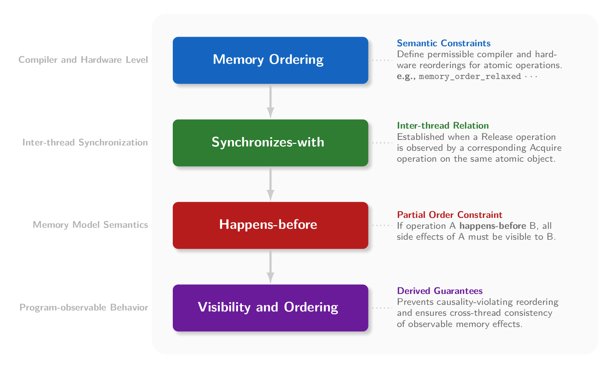
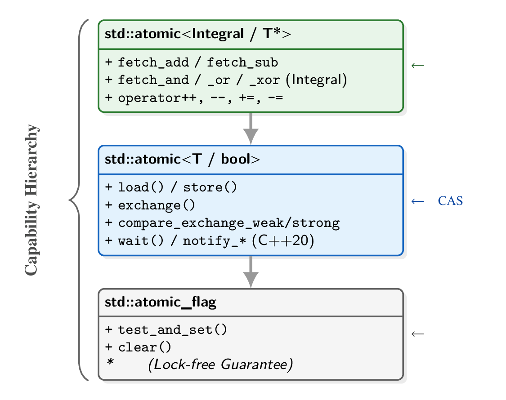

## 1. C++多线程历史

在 C++11 之前，C++ 只是一个“单线程语言”。要实现多线程，必须针对不同操作系统调用底层 API（如 Linux 的 `pthread` 或 Windows 的 `WinAPI`）。C++11 引入了**原生多线程支持**，并在后续标准中不断完善，形成了一套跨平台、类型安全且高效的并发编程模型。


| 特性 | C++98 / C++03 | C++11 及以后 |
| :--- | :--- | :--- |
| **线程感知** | **无** (语言层面不承认线程存在) | **原生支持** (`std::thread`) |
| **内存模型** | 无 (依赖编译器/硬件，易出 Bug) | **定义了严格的内存模型** |
| **跨平台** | 需手写 `#ifdef _WIN32` 或依赖 Boost | 标准库统一封装，代码通用 |
| **原子操作** | 依赖汇编或 OS API (`InterlockedIncrement`) | `std::atomic` 模板类 |

### 1.1 内存模型 (Memory Model)

* **最小内存单位 (Memory Location)**：最小可独立访问单元，不同单位的访问不会形成数据竞争（无需同步）；
* **数据竞争 (Data Race)**：多个线程对同一块内存单位（至少有一个）写，未加同步措施 $\rightarrow$ **未定义行为**。
* **修改顺序 (Modification Order)**：对**单个原子变量**存在全局一致的修改顺序。

### 1.2 同步 (Synchronization) 三要素

1.  **原子性 (Atomicity)**：最小操作不可分割，中间状态不可见。
2.  **可见性 (Visibility)**：通过**同步原语**约束，其他线程能够观察到某个线程的对共享变量的修改。
3.  **有序性 (Ordering)**：允许编译器和处理器重排序，但不能违反 happens-before 所建立的因果顺序。



---

## 2. 线程管理

### 2.1 Show Me Your Codes.

：用 RAII 类自动管理线程，避免忘记 join/detach 导致资源泄漏或访问悬空引用。

：
  - 工厂模式 (spawn_worker)：将线程创建逻辑封装，返回`std::thread`对象，**由调用者决定回收策略**。
  - 批量管理：通过移动语义使用一个线程容器`std::vector<std::thread>`批量管理线程，简化代码。

：`std::jthread`，自动汇合，支持协作式中断。

### 2.2 线程管理与避坑指南

`std::thread`是用户态的句柄，底层通常对应一个由操作系统内核管理的线程实体。但本质都不是 CPU 核心：线程是操作系统调度的最小单位，CPU 核心是实际执行指令的硬件资源。

**⚠ 注意**：
- **避免 Vexing Parse**：使用统一初始化`std::thread t1{task()};`或Lambda表达式`std::thread t2([]{ ... });`
- **最佳实践**：使用 RAII 类管理线程生命周期，抛出异常时要确保线程资源被正确回收（使用try-catch或RAII类）。
- **参数传递**：传参时默认按值拷贝，字符串字面量必须显式转换为`std::string`，引用`std::ref`或`std::cref`，不可拷贝类型必须使用`std::move`传递。
- std::thread本身只能移动(move)，**不可拷贝**。（比如压入`std::vector`或从工厂函数返回（NRVO））
- 线程数应结合任务粒度（IO密集型 vs CPU密集型）动态调整，可使用`std::thread::hardware_concurrency()`确定硬件支持的并发线程数。

---

## 3. 共享数据保护（Mutex & Lock）

### 3.1 Show Me Your Codes.

：重点关注接口安全（Interface Safety）设计。

：重点关注死锁防御体系设计。

：展示`std::unique_lock`的灵活用法：延迟加锁、提前解锁、可转移所有权。

：线程安全的单例模式实现（局部 `static` 实例对象 / `std::call_once`）。

： 读多写少场景下的共享数据保护。

### 3.2 互斥锁原理与避坑指南

并发问题的本质：在一个线程尚未恢复共享**不变量**时，被另一个线程观察或干扰。竞态条件有：数据竞争、高层竞态。
1. **数据竞争**：多线程访问同一内存单元，至少一个是写操作，且未加同步措施 $\rightarrow$ 未定义行为。
2. **高层竞态**：即使不存在数据竞争，线程执行顺序仍可能导致程序违反逻辑约束或语义期望的情况。
   - 接口竞争（check-then-act）：比如经典的序列错误`if (!s.empty()) { int v = s.top(); s.pop(); }`。
   - 丢失更新（lost update）：读取-修改-写入序列的中间状态被其他线程观察到，导致逻辑冲突。

**解决方案**：
1. **阻塞同步**（悲观锁定）：通过互斥锁(`std::mutex`)强行**串行化**，确保同一时间只有一个线程访问**临界区**。
2. **无锁编程**（底层原语）：利用 CPU 提供的原子指令(CAS, `std::atomic`)争抢资源，失败则**自旋**重试。
3. **软件事务内存**（乐观并发）：将一组操作封装为事务，提交时检测版本冲突，若冲突则**回滚并自动重试**。
4. **异步消息传递**（无共享）：**通过通信共享内存**（Actor/CSP模型），线程间持有私有状态，通过消息队列交互。

**⚠ 注意**：
1. **避免数据外泄**：保护共享数据时，避免返回受保护数据的**引用或指针**、将受保护数据传参给**外部回调函数**。
2. **死锁 (Deadlock) 防御体系**：避免互持锁等待。
   - 首选方案 (C++17)：`std::scoped_lock`。能一次性以原子方式锁定多个 Mutex，内部保证上锁顺序一致。
   - 备选方案 (C++11)：`std::lock(m1, m2, ...)`配合`std::lock_guard`的`std::adopt_lock`参数。
3. **减小临界区与锁竞争**：细粒度锁、读写锁分离、步进式加锁（Hand-over-hand Locking 遍历链表或树形结构）。
4. **try-lock 策略**：try-lock 无法获得锁时，立即释放已持有的所有锁并回滚状态，延迟后重新尝试（自我剥夺）。
5. **锁层级设计**：为每个互斥量分配层级编号，规定线程只能按照编号递减（或递增）的顺序加锁，消除环路等待。

**RAII 风格的锁管理**：

`std::lock_guard`(C++11)，`std::unique_lock`(C++11)，`std::shared_lock`(C++14)，`std::scoped_lock`(C++17)。

**∴ 总结**：优先采用**串行化或粗粒度锁**以保证系统正确、可维护；在架构层面引入细粒度锁、无锁队列或层级锁协议。

---

## 4. 同步操作

### 4.1 Show Me Your Codes.

： 使用条件变量实现生产者-消费者模型，重点关注**虚假唤醒**与**唤醒丢失**。

：**异步执行**与**延迟执行**两种模式。

：将可调用对象包装为异步任务，与`std::future`关联。

：使用`std::promise`-`std::future`建立线程间结果通道。

：使用`std::shared_future`实现多线程共享异步结果。

：使用`std::chrono`实现类型安全的时间处理与等待。

：使用`Boost.Future`实现函数化链式异步任务。

### 4.2 操作系统调度原理

**线程控制块(TCB)**：ID、CPU 上下文（PC/SP指针, 通用/浮点/SIMD 寄存器）、线程状态、调度优先级、信号掩码等。

**调度器对TCB的管理**：TCB 在 CPU 核心、**就绪队列 Ready Queue** 与 **等待队列 Wait Queue**之间流转。
- 运行（Running）：TCB 加载到寄存器中，CPU硬件核心执行线程指令。
- 就绪（Ready）：TCB 存于就绪队列中，等待调度器分配 CPU 时间片。
- 阻塞（Blocked）：TCB 移出就绪队列，挂入对应的等待队列中，等待外部事件（锁、I/O、信号）。
- 挂起（Suspended）：TCB 仍然在内存中，但进程的虚拟内存被换出到磁盘，等待恢复。
- 终止（Terminated）：资源（栈、寄存器）立即释放，仅留 TCB 等待父/主线程（Zombie/Terminate）回收。

### 4.3 同步操作原理与避坑指南

同步机制有两类：基于状态的同步（条件变量 CV）和基于事件的同步（异步任务 Future/Promise）。

**⚠ 注意**：
1. 基于状态的同步（**条件变量 CV**）：
   - 虚假唤醒：`wait()`可能在没有 notify 的情况下被唤醒，必须在循环中检查谓词。
   - 唤醒丢失：`notify_one()`在没有等待线程时调用会丢失唤醒信号，CV 没有记忆功能（不像信号量）。
   - 惊群效应：`notify_all()`会唤醒所有等待线程，可能导致大量线程竞争 CPU，影响性能。
   - 解锁时机：建议先释放锁再调用`notify_one()`/`notify_all()`，避免唤醒线程立即阻塞等待锁。

2. 基于事件的同步（**异步任务 Future/Promise**）：
   - 死亡之吻（Future 的析构阻塞）：如果`std::future`变成临时对象，会在析构时阻塞等待。
   - 异常传播：`std::future`可用于跨进程传播异常，`p.set_exception()`设置异常，`f.get()`重新抛出。
   - 并发版`std::function`：`std::packaged_task`将可调用对象包装为异步任务，可与`std::future`关联。
   - `std::atomic_wait`：C++20 允许对原子变量进行等/醒操作，在某些场景下可以替代 CV。

3. C++20多线程阶段性协作同步原语：
   - `std::latch`锁存器：一次性计数器。例如主线程等待多个线程初始化完成后再继续。
   - `std::barrier`栅栏：可重置的同步点。例如并行计算中的“第 N 轮迭代结束后，所有人对齐再进入下一轮”。

### 4.4 时间处理`std::chrono`全景图


C++11引入`<chrono>`头文件，提供类型安全的**时间处理机制**，有三大核心类型：
- **时间原点**（Epoch）：`system_clock`（系统时间，可调整）、`steady_clock`（单调递增，不可调整）。
- **持续时间**：`std::chrono::duration<Rep, Period>`：两个时间点的差值，由节拍数值类型和节拍单位类型组成。
  - `Rep`节拍数值类型：表示时间段的数值类型，如`int`, `long`, `double`等。
  - `Period`节拍单位类型：如`std::ratio<1, 1000>`表示毫秒(ms)、`std::ratio<60>`表示分钟(min)。
- **时间点**：`std::chrono::time_point<Epoch, Duration>`：表示某个时刻，由纪元时钟类型和持续时间段类型组成。

**⚠ 注意**：
1. `wait_for`默认使用稳定时钟，但容易**假唤醒**无限等待，相当于`wait_until(now() + dur)`，`wait_until`更可靠。
2. 时间段支持隐式转换（大向小单位），但可能损失精度（比如浮点数），建议显式转换`std::chrono::duration_cast`。

### 4.5 函数化链式范式 (未来趋势)

`Boost.Future`/`Boost.Thread`库引入了`then`、`when_all`和`when_any`等组合子。让代码看起来更像**函数式编程风格**。

---

## 5. 原子操作和内存模型

### 5.1 Show Me Your Codes.

：使用`std::atomic`+CAS实现的无锁栈(lock-free stack)。

：展示不同内存序对多线程可见性的影响。

：使用`std::atomic_flag`实现的简单自旋锁。

：使用`std::atomic<std::shared_ptr<T>>`实现的线程安全智能指针更新。

### 5.2 内存模型与内存序原理

**原子操作**是不可分割的内存访问，对于每一个**原子变量**，所有线程对其修改顺序全局一致（由内存模型保证）。

> **✎ 备注**：**修改顺序**强调对某个变量修改的观察顺序**全局一致**，而**内存序**强调**跨变量**，限制指令重排，约束数据**可见性**。同步概念里的happens-before是一种跨变量的偏序(partial order)，由原子操作和内存序共同保证。


**原子类型**遵循：
1. 不可拷贝/赋值（只能`.store()`和`.load()`）；
2. 所有成员函数接受`std::memory_order`参数，默认使用`memory_order_seq_cst`；
3. 不支持隐式转换为非原子类型（必须显式`.load()`才能读取值）。

`std::atomic_flag`是C++中唯一保证在**所有平台上无锁**（lock-free）的原子类型，一般用作自旋锁/状态标志。

`std::atomic<T>`为可平凡拷贝（Trivially Copyable）类型提供原子读写。是否lock-free由平台决定。

> **✎ 备注**：可平凡拷贝类型要求使用默认拷贝/赋值构造，没有虚表指针、虚基类指针，不包含复杂资源管理语义。C++20引入`std::atomic<float>`和`std::atomic<double>`支持浮点原子操作。

`std::atomic<T*>`提供对指针的原子操作，常用于无锁数据结构中的地址更新。

> **✎ 备注**：智能指针`std::shared_ptr`的引用计数是原子操作，但本身**不可原子化**，C++11–17只能通过`std::atomic_load(&sp)`和`std::atomic_store(&sp)`进行原子读写。C++20对智能指针特化，引入`std::atomic<std::shared_ptr<T>>`和`std::atomic<std::weak_ptr<T>>`支持原子操作。



--- 

## 6. 基于锁的并发数据结构设计

### 6.1 Show Me Your Codes.

：重点关注接口安全（Interface Safety）设计。

：使用条件变量实现的线程安全队列，支持多生产者-多消费者模型。

：使用细粒度锁和步进式加锁实现的线程安全链表。

：使用分段读写锁实现的线程安全哈希表。

### 6.2 设计原则与避坑指南

**⚠ 注意**：
1. **异常安全**：锁的获取与释放应通过 RAII 机制，确保在**异常控制流**不会锁 / 资源泄漏或数据结构不变式被破坏。
2. **接口安全**：避免因接口定义导致的**固有竞态条件**（Inherent Race Condition）。
3. **最大化并发**：**避免全局串行化**，从“一把大锁”进化为**细粒度锁**或**分段锁**。

**接口安全经典反例**：
```cpp
if (!stack.empty()) { // 检查栈是否为空
    int value = stack.top(); // 读取栈顶元素
    stack.pop(); // 弹出栈顶元素
}
```

---

## 7. 无锁并发数据结构设计

### 7.1 Show Me Your Codes.

：使用`std::atomic`+CAS实现的无锁栈(lock-free stack)。

：使用`std::atomic`+CAS实现的无锁队列(lock-free queue)。

：单生产者-单消费者无锁环形缓冲区。

：使用风险指针实现的安全内存回收机制。

：使用延迟回收实现的安全内存回收机制。


### 7.2 设计原则与避坑指南


**⚠ 注意**：
1. **无锁 ≠ 高性能**：无锁结构通常伴随更高的复杂度和开销，，仅在锁竞争成为瓶颈的高并发场景下才具备优势。
2. **正确性优先于性能**：无锁设计必须首先确保**线程安全性**和**系统前进性**，再考虑内存序等性能优化。
3. **ABA问题防范**：何基于 CAS 的算法都必须显式解决 ABA 问题（值变回原样但状态已变）。
   1. 使用**标记位**或**版本号**：将指针与版本号打包在一起，CAS 时同时比较指针和版本号。
   2. 使用**双倍宽度 CAS**：利用 CPU 支持的双倍宽度原子操作，同时更新指针和版本号。
4. **内存回收策略**：无锁环境缺乏自动 GC，必须显式设计**安全内存回收（SMR）**策略。
   1. 延迟回收：维护一个**待删除节点链表**，当活跃线程都离开 Epoch 后（全局计数器为零）回收。
   2. 风险指针：读线程对目标节点“举手示意”（**全局可见指针**），写线程在删除前扫描，“无人举手”才可回收。
   3. 分离引用计数：将普通计数分离为 **外部链接数** 和 **内部引用数** ，二者皆零时方可释放。
5. **优先复用成熟无锁库**：`Intel TBB`、`Facebook Folly`、`Concurrency Kit`等。
6. **内存序默认最强**：`std::memory_order_seq_cst`，仅在确认是性能热点且逻辑无误后再针对性放宽。
7. **实现协助机制 (Helping)**：若遇冲突应实现线程间的“协助”，而非阻塞等待，以保证系统整体吞吐。
