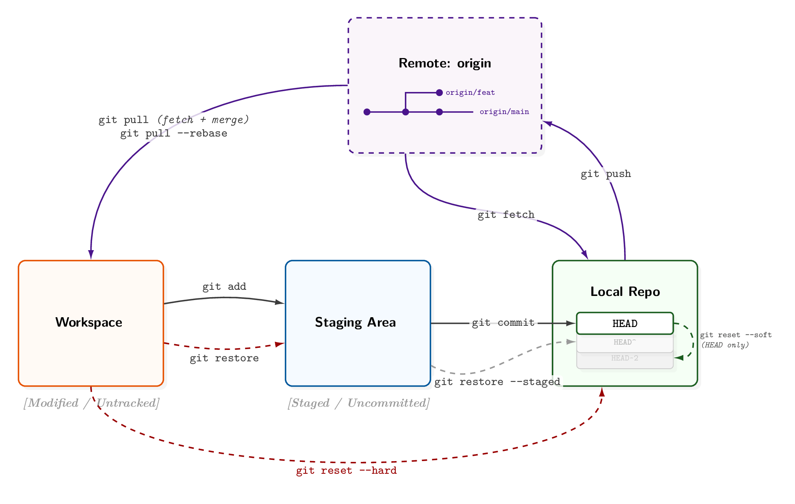
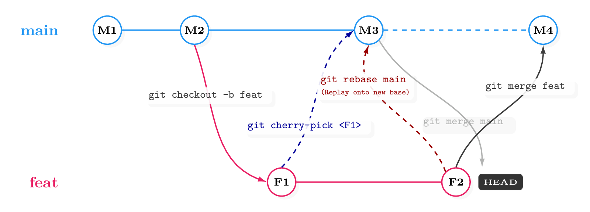
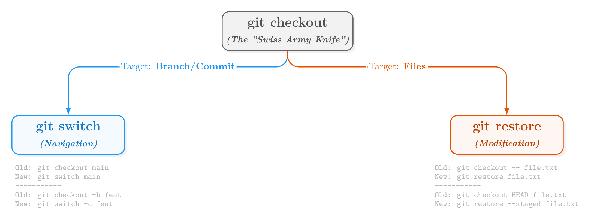

## 1 Authenticate 认证

### 1.1 HTTPS + Token

可以存储 PAT 配置：
```sh
git config --global credential.helper store                  # 永久明文存储在磁盘 (~/.git-credentials)
git config --global credential.helper 'cache --timeout=3600' # 在内存中缓存1小时
```

也可以将 Token 直接作为密码输入：
```sh
git remote set-url origin https://<用户名>:<Token>@github.com/<用户名>/<仓库>.git
```

### 1.2 SSH Key

```sh
# 1. 生成密钥
ssh-keygen -t ed25519 -C "you@example.com"
# 或者: ssh-keygen -t rsa -b 4096 -C "you@example.com"

# 2. 查看公钥 (GitHub -> Settings -> SSH keys)
cat ~/.ssh/id_ed25519.pub

# 3. 测试连接
ssh -T git@github.com  # 看到 "Hi <username>!" 即成功
```

### 1.3 全局配置用户名和邮箱

```sh
git config --global user.name "your name"
git config --global user.email "you@example.com"
git config --global init.defaultBranch main        # 设置新建仓库默认分支为 main
git config --global core.editor "code --wait"      # 设置 VS Code 为默认编辑器
git config --global merge.tool "code --wait"       # 设置合并工具
```

---

## 2. Detailed Workflow

### 2.1 Git Flow Overview



### 2.2 Branching Model



### 2.3 checkout & Restore / Switch



